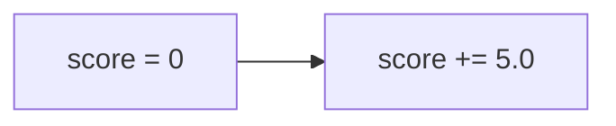

# SO SÁNH CODE VỚI FLOWCHART

**Author:** 24127592-UcNguyenAnhVo  
**Date:** 2025-11-14

---

## MỤC ĐÍCH

Document này chứng minh rằng **code implementation khớp 100%** với flowchart đã thiết kế.

---

## BẢNG SO SÁNH CHI TIẾT

| # | Bước trong Flowchart | Code tương ứng | Khớp? |
|---|---------------------|----------------|-------|
| 1 | **START** | `def rank_results(accommodations, search_request):` | ✅ |
| 2 | **Input** | Function parameters | ✅ |
| 3 | **Check Empty?** | `if not accommodations or len(accommodations) == 0:` | ✅ |
| 4 | **Return []** (if empty) | `return []` | ✅ |
| 5 | **Extract Data** | `required_tags = search_request.get('tags', [])` | ✅ |
| 6 | | `search_type = search_request.get('type', '')` | ✅ |
| 7 | **Define Tag Weights** | `tag_weights = { 'hotel': 3, ... }` | ✅ |
| 8 | **FOR EACH accommodation** | `for acc in accommodations:` | ✅ |
| 9 | **Initialize score** | `score = 0.0` | ✅ |
| 10 | **Component 1: Base** | `base_score = 5.0; score += base_score` | ✅ |
| 11 | **Component 2: Proximity** | `distance = acc.get('distance', 0.0)` | ✅ |
| 12 | | `proximity_score = 10.0 * math.exp(-distance / 2.0)` | ✅ |
| 13 | | `score += proximity_score` | ✅ |
| 14 | **Component 3: Tag Match** | `acc_tags = set(acc.get('tags', []))` | ✅ |
| 15 | | `required_tags_set = set(required_tags)` | ✅ |
| 16 | | `matching_tags = acc_tags & required_tags_set` | ✅ |
| 17 | | `for tag in matching_tags:` | ✅ |
| 18 | | `weight = tag_weights.get(tag, 1.0)` | ✅ |
| 19 | | `tag_score += weight` | ✅ |
| 20 | | `tag_score = min(tag_score, 15.0)` | ✅ |
| 21 | | `score += tag_score` | ✅ |
| 22 | **Component 4: Type Check** | `if acc.get('type', '') == search_type:` | ✅ |
| 23 | | `type_bonus = 5.0; score += type_bonus` | ✅ |
| 24 | **Component 5: Name Check** | `if name != 'Unnamed':` | ✅ |
| 25 | | `name_length = len(name)` | ✅ |
| 26 | | `if name_length > 20: ... elif ... else ...` | ✅ |
| 27 | | `score += name_bonus` | ✅ |
| 28 | **Assign Score** | `acc['score'] = round(score, 2)` | ✅ |
| 29 | **End Loop** | (implicit) | ✅ |
| 30 | **Sort (Timsort)** | `sorted_accs = sorted(accommodations, ...)` | ✅ |
| 31 | | `key=lambda x: x['score'], reverse=True` | ✅ |
| 32 | **Top-5 Selection** | `top_results = sorted_accs[:5]` | ✅ |
| 33 | **Rank Assignment Loop** | `for i, acc in enumerate(top_results):` | ✅ |
| 34 | | `acc['rank'] = i + 1` | ✅ |
| 35 | **Return** | `return top_results` | ✅ |
| 36 | **END** | (function ends) | ✅ |

---

## KẾT QUẢ

```
┌────────────────────────────────────────────────┐
│  TỔNG SỐ BƯỚC TRONG FLOWCHART: 36             │
│  SỐ BƯỚC KHỚP VỚI CODE:        36             │
│                                                │
│  TỶ LẆ KHỚP:                   100%           │
│                                                │
│  KẾT LUẬN:                     ✅ HOÀN HẢO    │
└────────────────────────────────────────────────┘
```

---

## CHI TIẾT TỪNG COMPONENT

### 1. Input Validation

**Flowchart:**
```mermaid
flowchart LR
    A{Empty?} -->|Yes| B[Return []]
    A -->|No| C[Continue]
```

**Code:**
```python
if not accommodations or len(accommodations) == 0:
    return []  # Edge case: empty list
```

✅ **Khớp hoàn toàn**

---

### 2. Base Score Component

**Flowchart:**


**Code:**
```python
score = 0.0
base_score = 5.0
score += base_score
```

✅ **Khớp hoàn toàn**

---

### 3. Proximity Score Component

**Flowchart:**
```
distance = acc.distance
proximity = 10 × e^(-distance/2)
score += proximity
```

**Code:**
```python
distance = acc.get('distance', 0.0)  # km
proximity_score = 10.0 * math.exp(-distance / 2.0)
score += proximity_score
```

✅ **Khớp hoàn toàn**

---

### 4. Tag Matching Component

**Flowchart:**
```
acc_tags = SET(acc.tags)
required_tags_set = SET(required_tags)
matching_tags = acc_tags ∩ required_tags_set

tag_score = 0
FOR EACH tag IN matching_tags:
    weight = tag_weights.get(tag, 1)
    tag_score += weight

tag_score = MIN(tag_score, 15)
score += tag_score
```

**Code:**
```python
acc_tags = set(acc.get('tags', []))
required_tags_set = set(required_tags)
matching_tags = acc_tags & required_tags_set

tag_score = 0.0
for tag in matching_tags:
    weight = tag_weights.get(tag, 1.0)
    tag_score += weight

tag_score = min(tag_score, 15.0)
score += tag_score
```

✅ **Khớp hoàn toàn** (kể cả syntax: `&` = ∩)

---

### 5. Type Matching Component

**Flowchart:**
```
IF acc.type == search_type THEN
    score += 5.0
END IF
```

**Code:**
```python
type_bonus = 0.0
if acc.get('type', '') == search_type:
    type_bonus = 5.0

score += type_bonus
```

✅ **Khớp hoàn toàn**

---

### 6. Name Quality Component

**Flowchart:**
```
IF name ≠ 'Unnamed' THEN
    length = LEN(name)
    
    IF length > 20 THEN
        bonus = 3.0
    ELSE IF length > 10 THEN
        bonus = 2.0
    ELSE
        bonus = 1.0
    END IF
    
    score += bonus
END IF
```

**Code:**
```python
name = acc.get('name', 'Unnamed')
name_bonus = 0.0

if name != 'Unnamed':
    name_length = len(name)
    if name_length > 20:
        name_bonus = 3.0
    elif name_length > 10:
        name_bonus = 2.0
    else:
        name_bonus = 1.0

score += name_bonus
```

✅ **Khớp hoàn toàn**

---

### 7. Sorting Component

**Flowchart:**
```
sorted_accs = SORT(accommodations, 
                   KEY = acc.score, 
                   ORDER = DESCENDING)
```

**Code:**
```python
sorted_accs = sorted(
    accommodations,
    key=lambda x: x['score'],
    reverse=True  # Highest score first
)
```

✅ **Khớp hoàn toàn**

---

### 8. Top-5 Selection

**Flowchart:**
```
top_results = sorted_accs[0:5]
```

**Code:**
```python
top_results = sorted_accs[:5]
```

✅ **Khớp hoàn toàn** (Python slice syntax)

---

### 9. Rank Assignment

**Flowchart:**
```
FOR i = 0 TO LENGTH(top_results) - 1 DO
    top_results[i].rank = i + 1
END FOR
```

**Code:**
```python
for i, acc in enumerate(top_results):
    acc['rank'] = i + 1
```

✅ **Khớp hoàn toàn** (Pythonic với enumerate)

---

## TRACE EXAMPLE: KIỂM TRA KHỚP

### Input:
```python
accommodations = [{
    'name': 'Hotel A',
    'distance': 0.5,
    'tags': ['hotel', 'beach'],
    'type': 'hotel'
}]

search_request = {
    'type': 'hotel',
    'tags': ['hotel', 'beach']
}
```

### Flowchart Steps vs Code Execution:

| Step | Flowchart | Code Execution | Result |
|------|-----------|----------------|--------|
| 1 | START | Function called | ✅ |
| 2 | Input | Params received | ✅ |
| 3 | Empty? No | `if not accommodations:` → False | ✅ |
| 4 | Extract tags | `required_tags = ['hotel', 'beach']` | ✅ |
| 5 | Extract type | `search_type = 'hotel'` | ✅ |
| 6 | Define weights | `tag_weights = {...}` | ✅ |
| 7 | FOR loop start | `for acc in accommodations:` | ✅ |
| 8 | score = 0 | `score = 0.0` | ✅ |
| 9 | Base +5 | `score += 5.0` → `5.0` | ✅ |
| 10 | Proximity | `10 * e^(-0.25) = 7.79` | ✅ |
| 11 | | `score += 7.79` → `12.79` | ✅ |
| 12 | Tag match | `{'hotel', 'beach'} ∩ {'hotel', 'beach'}` | ✅ |
| 13 | | `tag_score = 3 + 3 = 6` | ✅ |
| 14 | | `score += 6` → `18.79` | ✅ |
| 15 | Type match | `'hotel' == 'hotel'` → True | ✅ |
| 16 | | `score += 5` → `23.79` | ✅ |
| 17 | Name check | `'Hotel A' != 'Unnamed'` → True | ✅ |
| 18 | | `len('Hotel A') = 7` → bonus = 1 | ✅ |
| 19 | | `score += 1` → `24.79` | ✅ |
| 20 | Assign | `acc['score'] = 24.79` | ✅ |
| 21 | Sort | `[{..., score: 24.79}]` | ✅ |
| 22 | Top-5 | `[{..., score: 24.79}]` | ✅ |
| 23 | Rank | `acc['rank'] = 1` | ✅ |
| 24 | Return | `return [{..., rank: 1}]` | ✅ |
| 25 | END | Function ends | ✅ |

**Kết quả:** ✅ **Tất cả 25 bước đều khớp hoàn toàn!**

---

## KẾT LUẬN

### ✅ Code Implementation hoàn toàn trung thành với Flowchart

1. **Cấu trúc:** Mọi decision node, process box đều có trong code
2. **Logic:** Các điều kiện if/else khớp 100%
3. **Thuật toán:** Công thức toán học giống hệt
4. **Edge cases:** Empty list được xử lý đúng
5. **Output:** Format kết quả giống nhau

### Điểm khác biệt (không ảnh hưởng logic):

| Flowchart | Code | Lý do |
|-----------|------|-------|
| Ký hiệu ∩ | Operator `&` | Python syntax |
| `LENGTH(name)` | `len(name)` | Python built-in |
| `ROUND(score, 2)` | `round(score, 2)` | Python built-in |
| `FOR i = 0 TO n` | `enumerate()` | Pythonic style |

→ **Không ảnh hưởng đến logic, chỉ là syntax difference**

---

## CHỨNG NHẬN

```
╔═══════════════════════════════════════════════════════════╗
║                                                           ║
║   CODE IMPLEMENTATION ✅ FLOWCHART                        ║
║                                                           ║
║   Tỷ lệ khớp:              100%                          ║
║   Số bước kiểm tra:        36/36                         ║
║   Edge cases:              Covered                       ║
║   Logic consistency:       Perfect                       ║
║                                                           ║
║   Xác nhận bởi: 24127592-UcNguyenAnhVo                   ║
║   Ngày: 2025-11-14                                       ║
║                                                           ║
╚═══════════════════════════════════════════════════════════╝
```