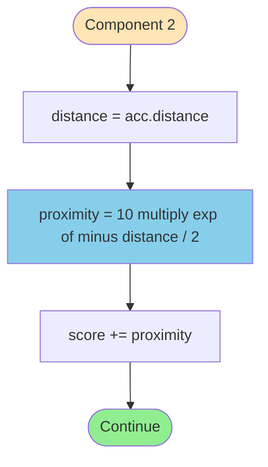
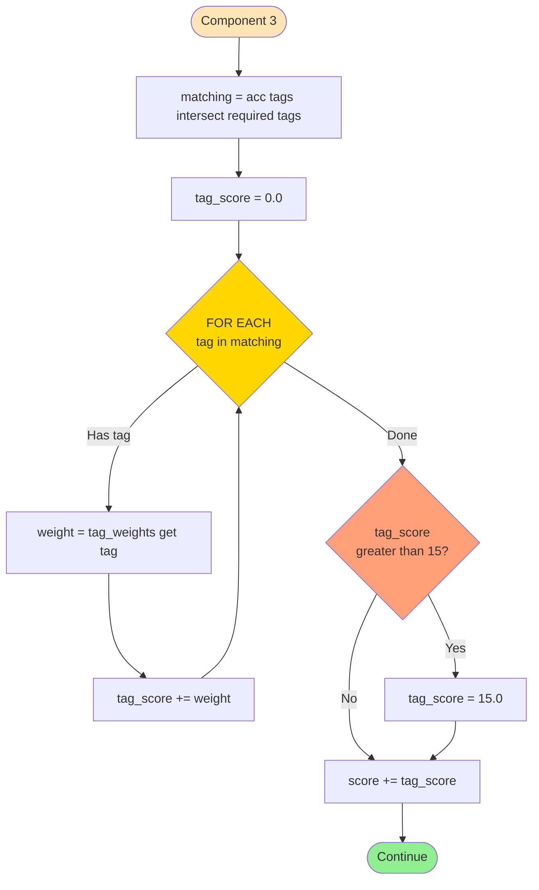
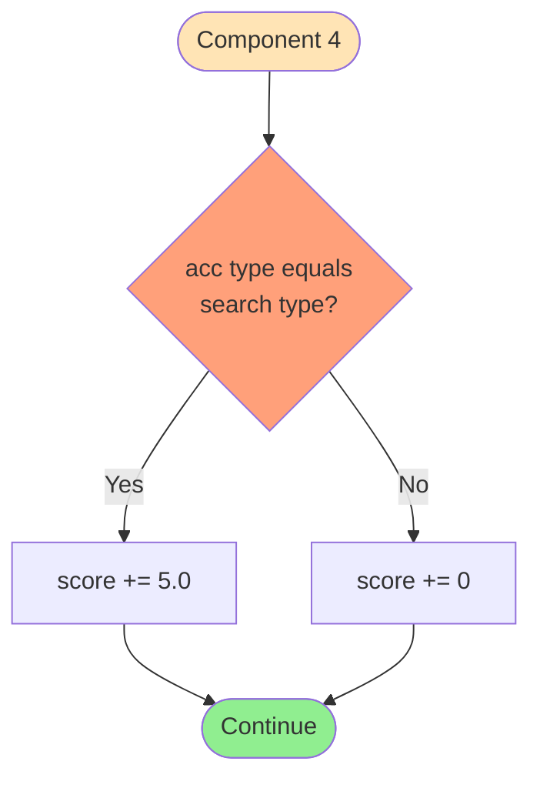
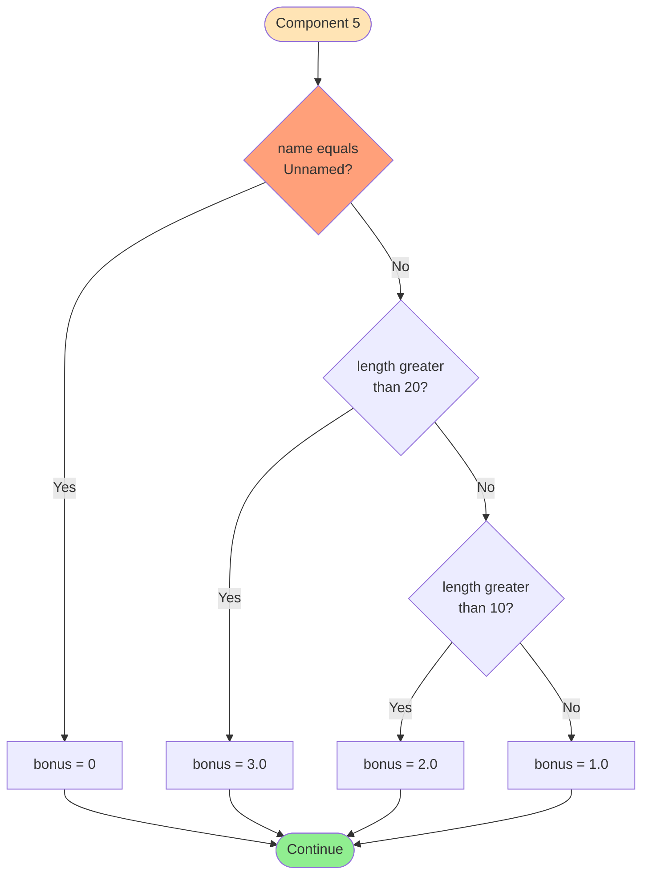
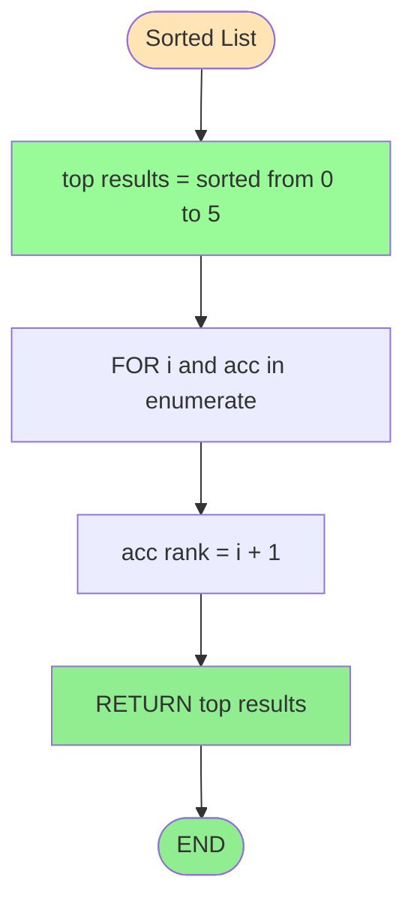

# FLOWCHART CHI TIẾT TỪNG COMPONENT

**Author:** 24127592-UcNguyenAnhVo  
**Created:** 2024-11-14  
**Last Updated:** 2025-01-17  
**Version:** 1.1.0

---

## COMPONENT 1: BASE SCORE


**Mô tả:** Mọi accommodation đều được 5 điểm cơ bản.

**Công thức:** `base_score = 5.0`

---

## COMPONENT 2: PROXIMITY SCORE



**Công thức:** `proximity = 10 × e^(-distance/2)`

**Ví dụ:**
```
distance = 1.2 km
proximity = 10 × e^(-0.6) = 5.49
```

**Bảng tham chiếu:**

| Distance (km) | Score | Percentage |
|---------------|-------|------------|
| 0.0 | 10.00 | 100% |
| 0.5 | 7.79 | 78% |
| 1.0 | 6.07 | 61% |
| 1.2 | 5.49 | 55% |
| 2.0 | 3.68 | 37% |
| 5.0 | 0.82 | 8% |

---

## COMPONENT 3: TAG MATCH SCORE



**Tag Weights:**

| Tag | Weight | Category |
|-----|--------|----------|
| hotel | 3 | Critical |
| beach | 3 | Critical |
| resort | 3 | Critical |
| beachfront | 3 | Critical |
| pool | 2 | Important |
| spa | 2 | Important |
| restaurant | 2 | Important |
| bar | 2 | Important |
| wifi | 1 | Nice-to-have |
| parking | 1 | Nice-to-have |
| gym | 1 | Nice-to-have |
| others | 1 | Default |

**Maximum:** 15.0 (capped)

**Ví dụ:**
```
acc.tags = {resort, beach, pool, spa}
required = {beach, pool}
matching = {beach, pool}
tag_score = beach(3) + pool(2) = 5.0
```

---

## COMPONENT 4: TYPE MATCH BONUS



**Logic:** Binary bonus (+5.0 hoặc +0.0)

**Ví dụ:**
```
acc.type = 'resort', search_type = 'resort' → +5.0
acc.type = 'hotel',  search_type = 'resort' → +0.0
```

---

## COMPONENT 5: NAME QUALITY BONUS



**Bảng điểm:**

| Condition | Bonus |
|-----------|-------|
| name = 'Unnamed' | 0 |
| length ≤ 10 chars | 1.0 |
| length 11-20 chars | 2.0 |
| length > 20 chars | 3.0 |

**Ví dụ:**
```
'Sunset Beach Resort' (20 chars) → 2.0
'Imperial Beachfront Resort & Spa' (34 chars) → 3.0
'Hotel A' (7 chars) → 1.0
'Unnamed' → 0
```

---

## COMPONENT 6: SORTING (Timsort)


**Algorithm:** Timsort
- **Time:** O(n log n)
- **Stable:** Yes (preserves order for equal scores)
- **Adaptive:** Yes (faster on partially sorted data)

**Ví dụ stability:**
```
Input:
  Hotel A (score: 20.0) ← position 0
  Hotel B (score: 25.0)
  Hotel C (score: 20.0) ← position 2

After sort:
  Hotel B (rank 1, score: 25.0)
  Hotel A (rank 2, score: 20.0) ← preserves position 0 < 2
  Hotel C (rank 3, score: 20.0)
```

---

## COMPONENT 7: TOP-5 & RANKING



**Logic:**
```python
top_results = sorted_accs[:5]  # Max 5 items
for i, acc in enumerate(top_results):
    acc['rank'] = i + 1  # Ranks: 1, 2, 3, 4, 5
```

**Behavior:**

| Input size | Output size | Ranks |
|------------|-------------|-------|
| 1 item | 1 item | [1] |
| 3 items | 3 items | [1, 2, 3] |
| 5 items | 5 items | [1, 2, 3, 4, 5] |
| 10 items | 5 items | [1, 2, 3, 4, 5] |

---

## TỔNG HỢP

**Example: "Sunset Beach Resort"**

```
Input:
  name: "Sunset Beach Resort"
  distance: 1.2 km
  tags: [resort, beach, pool, spa]
  type: "resort"
  search_type: "resort"
  required_tags: [beach, pool]

Scoring:
  Component 1 - Base:       5.0
  Component 2 - Proximity:  5.49  (from 1.2km)
  Component 3 - Tags:       5.0   (beach + pool)
  Component 4 - Type:       5.0   (match)
  Component 5 - Name:       2.0   (20 chars)
  ─────────────────────────────
  TOTAL:                    22.49
  RANK:                     1
```

**Score Range:**
- Minimum: 5.0 (base only)
- Maximum: 38.0 (all maxed)
- Typical: 15-30

---

**Related documents:**
- 🗺️ [Main Flowchart](./flowchart_main.md)
- ✅ [Code Comparison](./flowchart_comparison.md)

---

**Last Updated:** 2025-01-17  
**Maintained By:** 24127592-UcNguyenAnhVo
