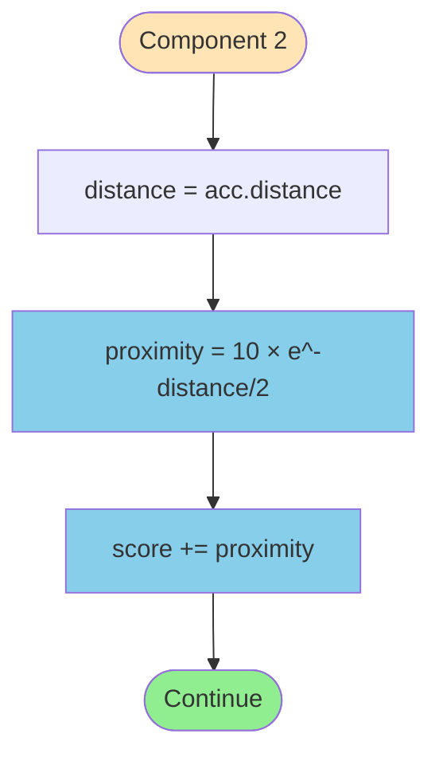
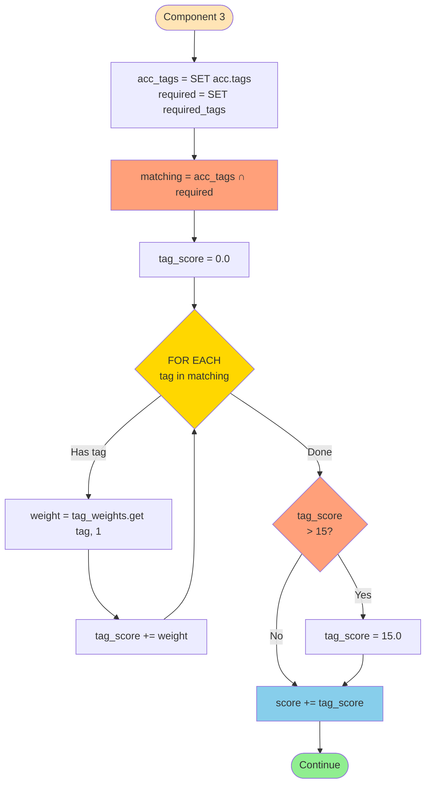
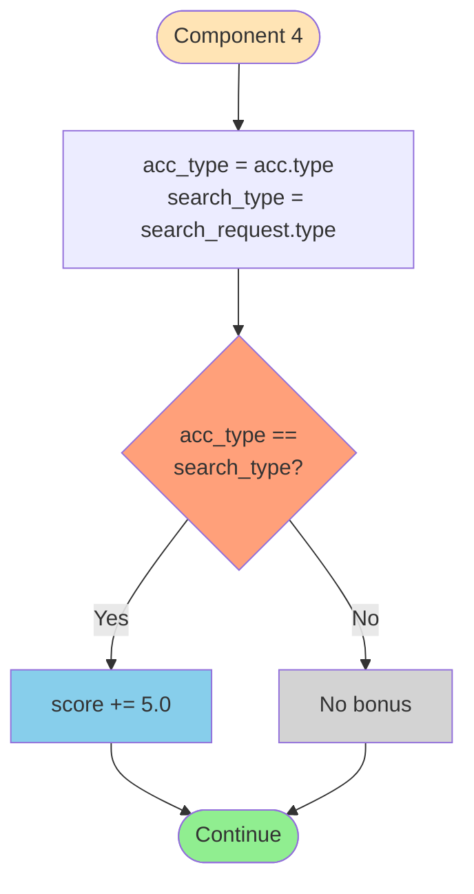
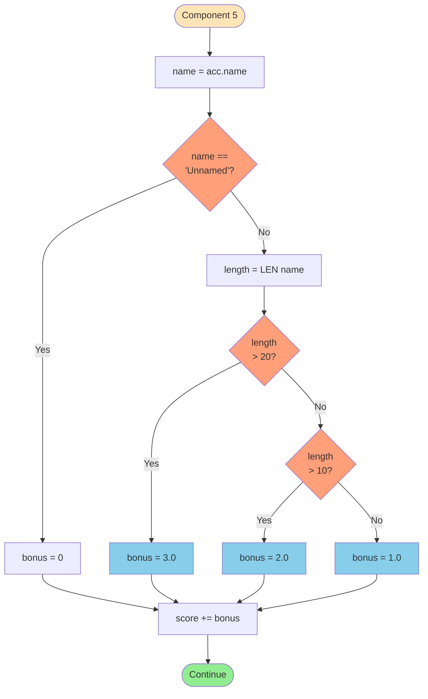
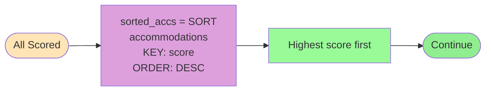
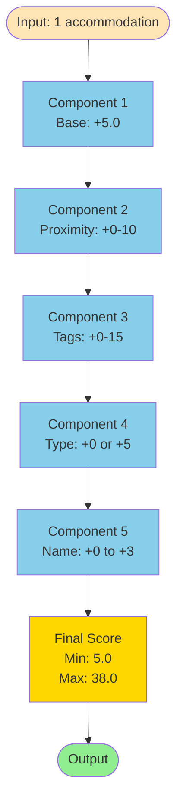

# FLOWCHART CHI TIẾT TỪNG COMPONENT

**Author:** 24127592-UcNguyenAnhVo  
**Date:** 2025-11-14

---

## COMPONENT 1: BASE SCORE


**Mô tả:**
- Đơn giản nhất
- Mọi accommodation đều được 5 điểm base

---

## COMPONENT 2: PROXIMITY SCORE



**Công thức:**
```
proximity_score = 10 × e^(-distance/2)

Examples:
- distance = 0.0km → 10.00 điểm
- distance = 0.5km → 7.79 điểm
- distance = 1.0km → 6.07 điểm
- distance = 2.0km → 3.68 điểm
```

---

## COMPONENT 3: TAG MATCH SCORE



**Weighted Tags:**
```
Critical (3 điểm):  hotel, beach, resort, beachfront
Important (2 điểm): pool, spa, restaurant, bar
Nice-to-have (1):   wifi, parking, gym
```

**Ví dụ:**
```
acc_tags = {'hotel', 'beach', 'pool', 'wifi'}
required_tags = {'hotel', 'beach', 'wifi'}

matching = {'hotel', 'beach', 'wifi'}

tag_score = 3 (hotel) + 3 (beach) + 1 (wifi) = 7 điểm
```

---

## COMPONENT 4: TYPE MATCH BONUS



**Ví dụ:**
```
Case 1: acc.type = 'hotel', search_type = 'hotel'
        → Match! → +5.0 điểm

Case 2: acc.type = 'resort', search_type = 'hotel'
        → No match → +0.0 điểm
```

---

## COMPONENT 5: NAME QUALITY BONUS



**Scale:**
```
Unnamed               → 0 điểm
Name ≤ 10 chars       → 1 điểm
Name 11-20 chars      → 2 điểm
Name > 20 chars       → 3 điểm
```

**Ví dụ:**
```
'Unnamed'                           → 0
'Hotel A'                           → 1 (7 chars)
'Grand Hotel'                       → 2 (12 chars)
'Imperial Beach Resort & Spa'       → 3 (28 chars)
```

---

## COMPONENT 6: SORTING (Timsort)



**Algorithm:** Timsort
- Time: O(n log n)
- Stable: Yes
- Adaptive: Yes (O(n) for sorted data)

---

## COMPONENT 7: TOP-5 SELECTION & RANKING

```mermaid
flowchart TD
    Start([Sorted List]) --> Slice[top_results = sorted_accs[0:5]]
    Slice --> InitLoop[i = 0]
    InitLoop --> LoopCheck{i < 5 AND<br/>i < LEN top_results?}
    
    LoopCheck -->|Yes| Assign[top_results[i].rank = i + 1]
    Assign --> Increment[i += 1]
    Increment --> LoopCheck
    
    LoopCheck -->|No| Return[RETURN top_results]
    Return --> End([END])
    
    style Start fill:#FFE4B5
    style Slice fill:#98FB98
    style LoopCheck fill:#FFD700
    style Assign fill:#87CEEB
    style Return fill:#90EE90
    style End fill:#90EE90
```

**Ví dụ:**
```
sorted_accs = [
    {name: 'A', score: 30},
    {name: 'B', score: 25},
    {name: 'C', score: 20},
    ...
]

top_results = [
    {name: 'A', score: 30, rank: 1},
    {name: 'B', score: 25, rank: 2},
    {name: 'C', score: 20, rank: 3},
    {name: 'D', score: 18, rank: 4},
    {name: 'E', score: 15, rank: 5}
]
```

---

## TỔNG HỢP TẤT CẢ COMPONENTS



**Score Range:**
```
Minimum: 5.0  (base only, unnamed, far, no matches)
Maximum: 38.0 (base + 10 proximity + 15 tags + 5 type + 3 name)

Typical: 15-30 điểm
```