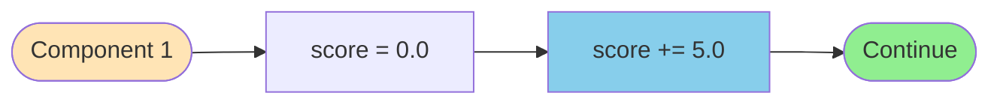
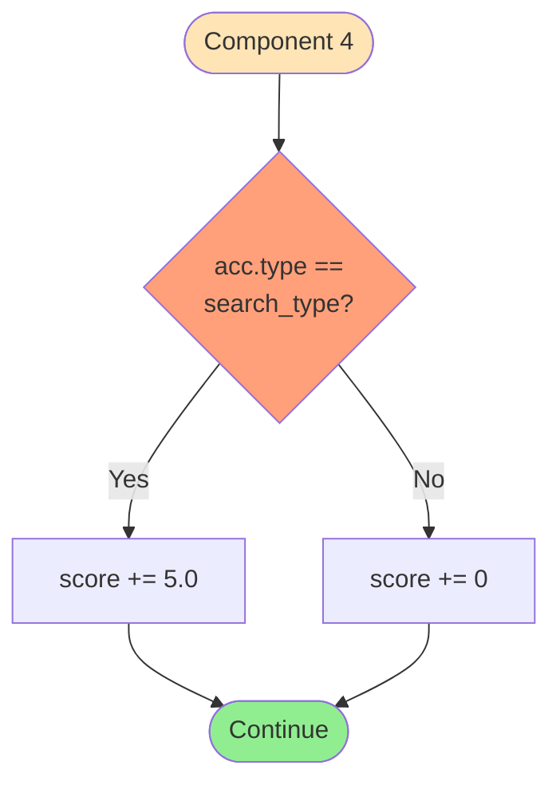
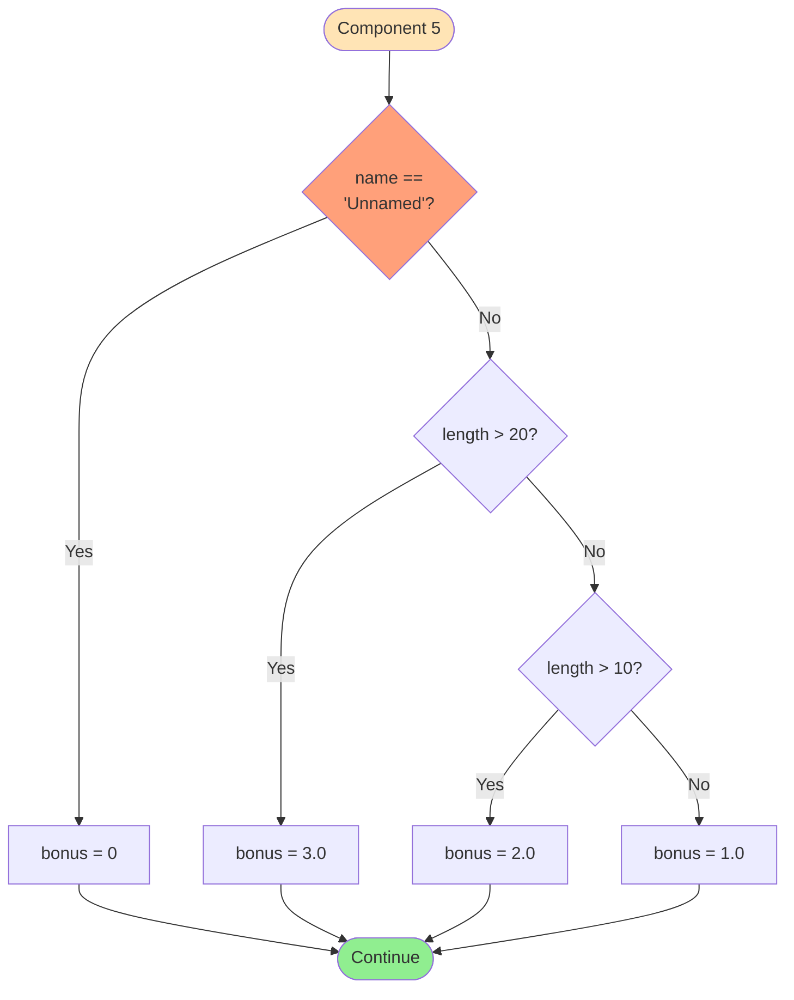
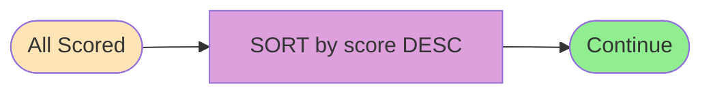

# FLOWCHART CHI TIẾT TỪNG COMPONENT

**Author:** 24127592-UcNguyenAnhVo  
**Created:** 2024-11-14  
**Last Updated:** 2025-01-17  
**Version:** 1.1.0

---

## COMPONENT 1: BASE SCORE



**Mô tả:** Mọi accommodation đều được 5 điểm cơ bản.

---

## COMPONENT 2: PROXIMITY SCORE

```mermaid
flowchart TD
    Start([Component 2]) --> GetDist[distance = acc.distance]
    GetDist --> CalcExp[proximity = 10 × e^(-distance/2)]
    CalcExp --> AddScore[score += proximity]
    AddScore --> End([Continue])
    
    style Start fill:#FFE4B5
    style CalcExp fill:#87CEEB
    style End fill:#90EE90
```

**Công thức:** `proximity = 10 × e^(-distance/2)`

**Ví dụ:**
```
distance = 1.2 km → proximity = 10 × e^(-0.6) = 5.49
```

**Table:**
| Distance | Score | % |
|----------|-------|---|
| 0.0 km   | 10.00 | 100% |
| 1.0 km   | 6.07  | 61% |
| 2.0 km   | 3.68  | 37% |
| 5.0 km   | 0.82  | 8% |

---

## COMPONENT 3: TAG MATCH SCORE

```mermaid
flowchart TD
    Start([Component 3]) --> CreateSets[matching = acc.tags ∩ required]
    CreateSets --> InitTag[tag_score = 0.0]
    InitTag --> LoopStart{FOR EACH<br/>tag in matching}
    
    LoopStart -->|Has tag| GetWeight[weight = tag_weights[tag]]
    GetWeight --> AddTag[tag_score += weight]
    AddTag --> LoopStart
    
    LoopStart -->|Done| Cap{tag_score<br/>> 15?}
    Cap -->|Yes| SetCap[tag_score = 15.0]
    Cap -->|No| AddToScore
    SetCap --> AddToScore[score += tag_score]
    AddToScore --> End([Continue])
    
    style Start fill:#FFE4B5
    style LoopStart fill:#FFD700
    style Cap fill:#FFA07A
    style End fill:#90EE90
```

**Weights:** hotel/beach/resort/beachfront=3, pool/spa/restaurant/bar=2, others=1  
**Max:** 15.0 (capped)

**Ví dụ:**
```
acc.tags = {resort, beach, pool, spa}
required = {beach, pool}
matching = {beach, pool}
tag_score = 3 + 2 = 5.0
```

---

## COMPONENT 4: TYPE MATCH BONUS



**Logic:** Binary bonus (+5.0 hoặc +0.0)

**Ví dụ:**
```
acc.type = 'resort', search_type = 'resort' → +5.0
acc.type = 'hotel',  search_type = 'resort' → +0.0
```

---

## COMPONENT 5: NAME QUALITY BONUS



**Scale:**
| Condition | Bonus |
|-----------|-------|
| 'Unnamed' | 0 |
| ≤ 10 chars | 1.0 |
| 11-20 chars | 2.0 |
| > 20 chars | 3.0 |

**Ví dụ:**
```
'Sunset Beach Resort' (20 chars) → 2.0
```

---

## COMPONENT 6: SORTING (Timsort)



**Algorithm:** Timsort (stable, O(n log n))

---

## COMPONENT 7: TOP-5 & RANKING

```mermaid
flowchart TD
    Start([Sorted List]) --> Slice[top_results = sorted[0:5]]
    Slice --> Loop[FOR i, acc in enumerate]
    Loop --> Assign[acc.rank = i + 1]
    Assign --> Return[RETURN top_results]
    Return --> End([END])
    
    style Start fill:#FFE4B5
    style Slice fill:#98FB98
    style Return fill:#90EE90
    style End fill:#90EE90
```

**Behavior:** Lấy max 5 items, gán ranks 1-5

---

## TỔNG HỢP

```
Example: "Sunset Beach Resort"
├─ Base:      5.0
├─ Proximity: 5.49 (1.2km)
├─ Tags:      5.0  (beach + pool)
├─ Type:      5.0  (resort match)
└─ Name:      2.0  (20 chars)
   ═══════════════
   TOTAL:    22.49
```

**Score Range:** Min=5.0, Max=38.0, Typical=15-30
