# FLOWCHART TỔNG THỂ - Thuật toán Ranking

**Author:** 24127592-UcNguyenAnhVo  
**Created:** 2024-11-14  
**Last Updated:** 2025-01-17  
**Version:** 1.1.0

---

## FLOWCHART CHÍNH

```mermaid
flowchart TD
    Start([🚀 START<br/>rank_results]) --> Input[📥 INPUT<br/>accommodations array<br/>search_request object]
    
    Input --> ValidateEmpty{accommodations<br/>empty?}
    ValidateEmpty -->|Yes| ReturnEmpty[↩️ RETURN empty array]
    ReturnEmpty --> End
    
    ValidateEmpty -->|No| Extract[📦 EXTRACT DATA<br/>required_tags from search_request<br/>search_type from search_request]
    
    Extract --> DefineWeights[⚙️ DEFINE TAG WEIGHTS<br/>hotel=3, beach=3, pool=2, wifi=1]
    
    DefineWeights --> InitLoop[🔄 FOR EACH<br/>acc in accommodations]
    
    InitLoop --> InitScore[💯 score = 0.0]
    
    InitScore --> AddBase[➕ Component 1: Base<br/>score += 5.0]
    
    AddBase --> CalcProximity[📏 Component 2: Proximity<br/>distance = acc.distance<br/>proximity = 10 × exp of -distance/2<br/>score += proximity]
    
    CalcProximity --> CalcTags[🏷️ Component 3: Tag Match<br/>matching = acc.tags intersect required<br/>tag_score = sum of weights<br/>capped at 15.0<br/>score += tag_score]
    
    CalcTags --> CheckType{Component 4:<br/>acc.type ==<br/>search_type?}
    
    CheckType -->|Yes| AddType[➕ score += 5.0]
    CheckType -->|No| CheckName
    AddType --> CheckName
    
    CheckName{Component 5:<br/>acc.name !=<br/>Unnamed?}
    
    CheckName -->|No| AssignScore
    CheckName -->|Yes| CheckLength{name length?}
    
    CheckLength -->|greater than 20| Add3[➕ score += 3.0]
    CheckLength -->|10 to 20| Add2[➕ score += 2.0]
    CheckLength -->|less than 10| Add1[➕ score += 1.0]
    
    Add3 --> AssignScore
    Add2 --> AssignScore
    Add1 --> AssignScore
    
    AssignScore[💾 acc.score = ROUND score to 2 decimals]
    
    AssignScore --> LoopCheck{More<br/>accommodations?}
    LoopCheck -->|Yes| InitLoop
    
    LoopCheck -->|No| Sort[📊 SORT Timsort<br/>sorted_accs = SORT accommodations<br/>KEY=score DESC]
    
    Sort --> GetTop5[🔝 TOP-5 SELECTION<br/>top_results = sorted_accs 0 to 5]
    
    GetTop5 --> RankLoop[🔄 FOR i = 0 to 4]
    
    RankLoop --> AssignRank[🏆 top_results i rank = i + 1]
    
    AssignRank --> RankCheck{i less than 4?}
    RankCheck -->|Yes| RankLoop
    
    RankCheck -->|No| Return[↩️ RETURN top_results]
    
    Return --> End([✅ END])
    
    style Start fill:#90EE90
    style End fill:#90EE90
    style InitScore fill:#FFE4B5
    style AddBase fill:#87CEEB
    style CalcProximity fill:#87CEEB
    style CalcTags fill:#87CEEB
    style CheckType fill:#FFA07A
    style CheckName fill:#FFA07A
    style CheckLength fill:#FFA07A
    style Sort fill:#DDA0DD
    style GetTop5 fill:#98FB98
    style Return fill:#90EE90
```



---

## GIẢI THÍCH KÝ HIỆU

```
([...])  = Start/End (Terminal)
[...]    = Process (Calculation/Operation)
{...}    = Decision (If/Else)
```

**Colors:**
- 🟢 Green = Start/End/Return
- 🟡 Yellow = Initialize
- 🔵 Blue = Calculations
- 🟠 Orange = Decisions
- 🟣 Purple = Sorting
- 🟢 Light Green = Selection

---

## LUỒNG THỰC THI

```
1. Validation:  START → Check Empty → Continue or Return []
2. Preparation: Extract tags and type → Define weights
3. Scoring:     FOR EACH accommodation → Calculate 5 components
4. Ranking:     Sort DESC → Get Top 5 → Assign ranks → Return
```

---

## SCORING COMPONENTS

```
Total Score = Base + Proximity + Tags + Type + Name
              5.0  + 0-10.0   + 0-15.0 + 0/5 + 0-3

Minimum: 5.0  
Maximum: 38.0  
Typical: 15-30
```

---

## TAG WEIGHTS

| Tag | Weight | Tag | Weight | Tag | Weight |
|-----|--------|-----|--------|-----|--------|
| hotel | 3 | pool | 2 | wifi | 1 |
| beach | 3 | spa | 2 | parking | 1 |
| resort | 3 | restaurant | 2 | gym | 1 |
| beachfront | 3 | bar | 2 | others | 1 |

**Maximum tag score:** 15.0 (capped)

---

## VÍ DỤ TÍNH TOÁN

### Input:
```json
{
  "name": "Sunset Beach Resort",
  "distance": 1.2,
  "tags": ["resort", "beach", "pool", "spa"],
  "type": "resort"
}
```

**Search request:** `{type: "resort", tags: ["beach", "pool"]}`

### Calculation:
```
Component 1 - Base:           5.0
Component 2 - Proximity:      10 × e^(-0.6) = 5.49
Component 3 - Tags:           beach(3) + pool(2) = 5.0
Component 4 - Type Match:     resort == resort → 5.0
Component 5 - Name Quality:   length(20) → 2.0
─────────────────────────────────────────────
TOTAL SCORE:                  22.49
RANK:                         1
```

---

## PROXIMITY SCORE TABLE

| Distance (km) | Formula | Score | Percentage |
|---------------|---------|-------|------------|
| 0.0 | 10 × e^(0) | 10.00 | 100% |
| 0.5 | 10 × e^(-0.25) | 7.79 | 78% |
| 1.0 | 10 × e^(-0.5) | 6.07 | 61% |
| 1.2 | 10 × e^(-0.6) | 5.49 | 55% |
| 2.0 | 10 × e^(-1.0) | 3.68 | 37% |
| 5.0 | 10 × e^(-2.5) | 0.82 | 8% |

---

## EDGE CASES

| Case | Behavior |
|------|----------|
| Empty list | Return empty array |
| Single item | Return 1 item with rank 1 |
| Tie scores | Stable sort preserves order |
| Less than 5 items | Return all with ranks |
| More than 5 items | Return top 5 only |
| No tag matches | tag_score = 0 |
| No type match | type_bonus = 0 |
| Unnamed accommodation | name_bonus = 0 |

---

## PERFORMANCE

**Time Complexity:** O(n log n) - dominated by Timsort  
**Space Complexity:** O(n)

**Breakdown:**
- Validation: O(1)
- Scoring loop: O(n × m) where m = avg tags per accommodation
- Sorting: O(n log n) ← bottleneck
- Top-5 selection: O(1)
- Rank assignment: O(1)

---

**Related documents:**  
- [Component Details](./flowchart_components.md)  
- [Code Comparison](./flowchart_comparison.md)

**Last Updated:** 2025-01-17  
**Maintained By:** 24127592-UcNguyenAnhVo
