# FLOWCHART TỔNG QUÁT - Thuật toán Ranking

**Author:** 24127592-UcNguyenAnhVo  
**Version:** 2.0.0 (Overview)  
**Updated:** 2025-01-17

---

## SƠ ĐỒ TỔNG QUAN

```mermaid
flowchart TD
    Start([🚀 BẮT ĐẦU]) --> Input[📥 Đầu vào<br/>Danh sách chỗ ở + Tiêu chí tìm kiếm]
    
    Input --> Validate{Kiểm tra<br/>dữ liệu}
    Validate -->|Rỗng/Lỗi| Error[↩️ Trả về kết quả rỗng]
    Validate -->|Hợp lệ| Scoring[💯 TÍNH ĐIỂM<br/><br/>Các yếu tố đánh giá:<br/>• Khoảng cách địa lý<br/>• Độ khớp tags/tiện ích<br/>• Loại hình chỗ ở<br/>• Chất lượng thông tin]
    
    Scoring --> Ranking[📊 XẾP HẠNG<br/><br/>Sắp xếp theo điểm<br/>Chọn Top 5 kết quả tốt nhất]
    
    Ranking --> Output[📤 Đầu ra<br/>Danh sách đã xếp hạng kèm điểm]
    
    Output --> End([✅ KẾT THÚC])
    Error --> End
    
    style Start fill:#90EE90
    style Scoring fill:#87CEEB
    style Ranking fill:#DDA0DD
    style Output fill:#98FB98
    style End fill:#90EE90
```



---

## MÔ TẢ CÁC GIAI ĐOẠN

### 1️⃣ Đầu vào (Input)
- **Dữ liệu:** Danh sách các chỗ ở, tiêu chí tìm kiếm của người dùng
- **Định dạng:** JSON array với thông tin: tên, vị trí, tags, loại hình

### 2️⃣ Kiểm tra (Validation)
- Xác minh dữ liệu không rỗng
- Xử lý trường hợp đặc biệt (empty list, invalid format)

### 3️⃣ Tính điểm (Scoring)
Mỗi chỗ ở nhận điểm tổng hợp từ **5 yếu tố**:

| Yếu tố | Mô tả | Điểm tối đa |
|--------|-------|-------------|
| **Base** | Điểm nền | 5.0 |
| **Proximity** | Dựa trên khoảng cách | 10.0 |
| **Tag Match** | Khớp tiện ích yêu cầu | 15.0 |
| **Type Match** | Khớp loại hình | 5.0 |
| **Name Quality** | Chất lượng thông tin | 3.0 |

**Tổng điểm:** 5.0 - 38.0

### 4️⃣ Xếp hạng (Ranking)
- Sắp xếp theo điểm giảm dần
- Chọn tối đa **5 kết quả tốt nhất**
- Gán rank từ 1 đến 5

### 5️⃣ Đầu ra (Output)
- Danh sách Top 5 chỗ ở
- Kèm theo: điểm số và thứ hạng

---

## CÔNG THỨC TỔNG QUÁT

```
Final Score = Base + Proximity(distance) + TagMatch(tags) + TypeBonus + NameBonus

Proximity: decay theo khoảng cách (exponential)
TagMatch:  tổng trọng số tags khớp (có giới hạn trên)
```

---

## ĐẶC ĐIỂM THUẬT TOÁN

- **Độ phức tạp:** O(n log n) — do bước sắp xếp
- **Thuật toán sort:** Timsort (stable, adaptive)
- **Khả năng mở rộng:** Dễ thêm yếu tố chấm điểm mới

---

## EDGE CASES

| Tình huống | Xử lý |
|-----------|-------|
| Danh sách rỗng | Trả về array rỗng |
| Ít hơn 5 items | Trả về tất cả |
| Nhiều hơn 5 items | Chỉ lấy Top 5 |
| Điểm bằng nhau | Giữ thứ tự ban đầu (stable sort) |

---

**Chi tiết implementation:** Xem [flowchart_main.md](./flowchart_main.md) và [flowchart_components.md](./flowchart_components.md)

---

**Maintained By:** 24127592-UcNguyenAnhVo
